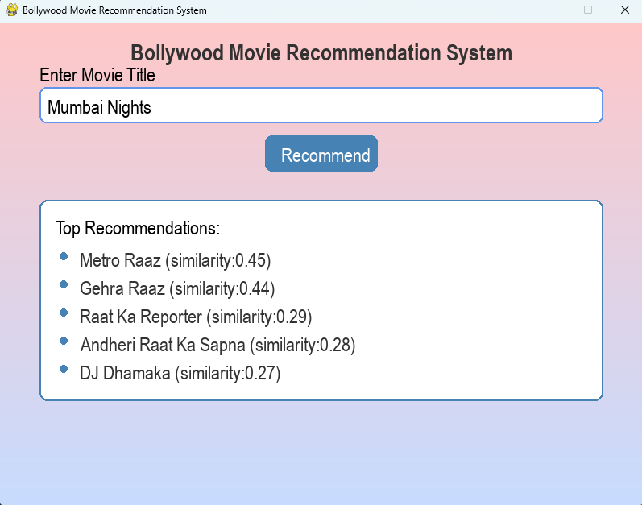

**🎬 Bollywood Movie Recommendation System**

An interactive and visually appealing movie recommendation system built with Pygame and powered by TF-IDF Vectorization and Cosine Similarity from scikit-learn. Users can input the name of a Bollywood movie and get top similar movie recommendations based on genre, theme, and description.

**🧠 Features**

🔍 Content-Based Recommendations using NLP

🎨 GUI Interface built with Pygame

📚 A diverse dataset of 100+ fictional Bollywood movie titles

🎥 Genre-rich movie descriptions: romance, action, thriller, comedy, sci-fi, and more

🎯 Simple and lightweight — no external API required

## Preview
>
>

**🚀 How It Works**

Movie descriptions are vectorized using TF-IDF.

Cosine similarity is calculated to compare movie plots.

Given a movie title, the top N most similar movies are recommended.

Results are shown in a beautiful GUI built using Pygame.

**🛠️Installation**

Prerequisites
Python 3.7+

**Install dependencies**

pip install pygame scikit-learn

▶️ Run the Project

python main.py

Then enter any movie title from the list to get recommendations.

**🎬 Sample Movies in Dataset**

3 Idiots
Gully Beat
Kho Gayi Khushi
Shaadi Squad
Bollywood Hacker
Magic Ki Shaadi
Zindagi Restart
Andheron Ka Sheher
(and many more...)

**🧪Example**

If you input:
Gully Beat
You might get recommendations like:
Gully Ki Garmi (similarity: 0.52)
Ek Tha Rapper (similarity: 0.49)
Zindagi Ka Exam (similarity: 0.43)
DJ Dhamaka (similarity: 0.38)
Gully Raftaar (similarity: 0.36)

**📁 File Structure**

main.py      # Main application file with GUI + logic

README.md                 # Project documentation

**💡 Technologies Used**

Python

Pygame – GUI rendering

scikit-learn – TF-IDF and Cosine Similarity

NLP – Text-based similarity

**🧑‍💻 CREATED BY**

MAYANK SINGH
